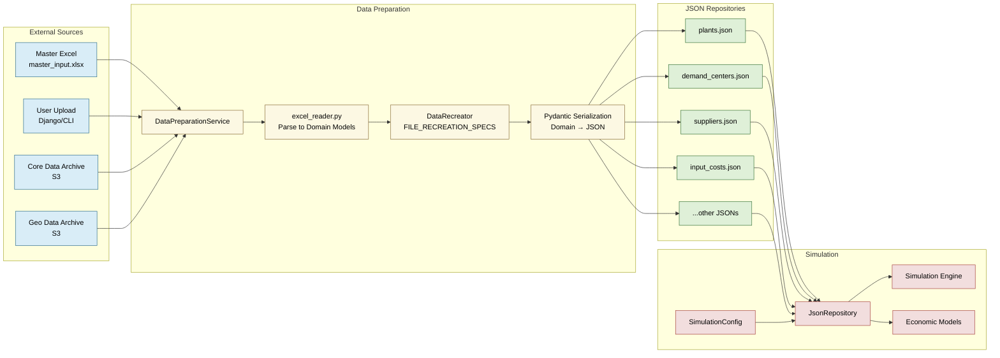

# Architecture Decision Record: Data Input Strategy

```
Status: Accepted
Date: 2025-03-06
Updated: 2025-07-18
```

## Context

The steel decarbonization modeling package requires a comprehensive data management strategy to handle complex datasets for economic modeling (Agent-Based Modeling, Stock and Flow models, and Trade Optimization). The system has evolved to use a centralized data preparation approach where:

- All user-changeable input data originates from a master input Excel file
- Excel data is parsed into domain models which are then serialized to JSON repository files for later use by the simulation
- Additional data comes from versioned archives (core-data and geo-data) stored in S3
- The simulation accesses all data through a unified SimulationConfig interface

The software is distributed as:
- A Python package with CLI tools
- A Django web interface with data upload capabilities
- An Electron desktop application with embedded Django for offline use

This architecture ensures data consistency, validation, and performance while supporting both default datasets and user-provided data.

## Decision Drivers

- **Ease of Use**: Non-technical users should be able to provide custom data with minimal friction.
- **Data Privacy**: Many users are hesitant to upload proprietary industry data to web platforms.
- **Consistency**: The system needs consistent data structures regardless of input source.
- **Flexibility**: Support for both default data and user-provided data is required.
- **Alignment**: The solution should align with our existing architecture patterns (Repository Pattern, Service Layer).

## Decision

We have implemented a **centralized data preparation architecture** that transforms a master input Excel file into validated JSON repositories:

1. **Master Input Excel**: 
   - Single source of truth for all user-configurable data
   - Contains multiple sheets for different data domains (plants, demand, suppliers, costs, etc.)
   - Versioned and stored in S3 for default datasets
   - Users can upload their own master Excel through Django UI or use CLI tools

2. **JSON Repository Pattern**:
   - Excel data is parsed by excel_reader.py into domain models
   - Domain models are serialized to JSON using Pydantic for validation
   - Provides consistent CRUD interface for data access
   - Enables separation of data preparation from simulation execution

3. **Data Archives**:
   - **core-data**: Pre-processed CSV and Excel files from various sources
   - **geo-data**: Geospatial data for renewable energy potential and infrastructure
   - Versioned packages downloaded from S3 with checksum validation
   - Managed through `manifest.json` configuration

4. **SimulationConfig**:
   - Central configuration object that references all JSON repository paths
   - Uses default path resolution for repository locations
   - Provides unified interface for simulation components to access data

## Data Preparation Process

The system transforms input data through a structured preparation pipeline:

### Input Data Sources

1. **Master Input Excel** (`master_input.xlsx`)
   - Central configuration file containing all user-modifiable parameters
   - Multiple sheets covering different data domains
   - Versioned and available from S3 or user upload

2. **Geo Data Archive** (from manifest.json)
   - Geospatial datasets for renewable energy analysis
   - Infrastructure data (railways, terrain)
   - Pre-computed optimization results

### JSON Repository Generation

The data preparation process creates the following JSON repositories from the master Excel:

- `plants.json` - Steel plant configurations and capacities
- `demand_centers.json` - Regional demand projections
- `suppliers.json` - Iron ore mine data
- `tariffs.json` - Trade tariff information
- `carbon_costs.json` - Carbon pricing by region and year
- `primary_feedstocks.json` - Bill of materials data
- `input_costs.json` - Regional input cost factors
- `tech_switches_allowed.csv` - Technology transition constraints
- And several others...

Each JSON file is:
- Validated using Pydantic models
- Sorted for consistent output
- Version-controlled for reproducibility

## Data Preparation Methods

Users can prepare data through two methods:

### 1. CLI Tool (`steelo-data-prepare`)
```bash
steelo-data-prepare --master-excel path/to/master_input.xlsx --output-dir data/fixtures
```
- Direct command-line interface
- Suitable for automation and scripting
- Progress reporting and validation

### 2. Django Web Interface
- Upload master Excel through web UI
- Visual progress tracking
- Integrated validation reporting
- Automatic preparation on first Electron app launch

## Implementation Details

### Data Flow



### Key Components

#### JsonRepository
The central data access layer that provides typed interfaces for all data:

```python
class JsonRepository:
    plants: PlantJsonRepository
    demand_centers: DemandCenterJsonRepository  
    suppliers: SupplierJsonRepository
    trade_tariffs: TariffJsonRepository
    input_costs: InputCostsJsonRepository
    # ... and many more
```

Each repository implements standard operations:
- `list()` - Get all entities
- `get(id)` - Get single entity by ID
- `add(entity)` - Add new entity
- `add_list(entities)` - Bulk add entities

#### DataPreparationService
Orchestrates the entire data preparation workflow:

```python
class DataPreparationService:
    def prepare_data(
        output_dir: Path,
        master_excel_path: Path | None = None,
        skip_existing: bool = True,
        progress_callback: Callable | None = None,
        geo_version: str | None = None,
    ) -> PreparationResult:
        # Downloads packages from S3
        # Processes master Excel
        # Creates JSON repositories
        # Validates output
```

#### SimulationConfig
Configuration object that ties everything together:

```python
@dataclass
class SimulationConfig:
    plants_path: str | None = None
    demand_centers_path: str | None = None
    suppliers_path: str | None = None
    # ... paths to all JSON repositories
    
    def _resolve_path(self, path: str) -> Path:
        # Resolves default paths
```

## Consequences

### Advantages

- **Early Error Detection**: Parsing errors are caught during data preparation, not during simulation runtime
- **Single Source of Truth**: Master Excel provides clear, centralized configuration
- **Clear Data Lineage**: Easy to trace data from source Excel to JSON to simulation

### Disadvantages

- **Preparation Step Required**: Cannot run simulation directly from Excel
- **Schema Evolution**: Changes to data structure require updating multiple components
- **Excel Dependency**: Master input format tied to Excel structure
- **Complexity**: Multiple layers of abstraction between raw data and simulation

## Alternatives Considered

- **Direct Excel/CSV Processing**: Rejected because errors would only show during simulation run, potentially minutes or hours after starting, which would be massively frustrating to users.
- **Database-Only Storage**: Rejected because users want to modify the data in Excel.
- **Multiple Input Files**: Rejected in favor of single master Excel to reduce complexity for users and ensure consistency across data domains.

## References

- [Repository Pattern ADR (002)](002_repository.md)
- [Configuration Management ADR (003)](003_configuration.md)
- [Cosmic Python: Repository Pattern](https://www.cosmicpython.com/book/chapter_02_repository.html)
