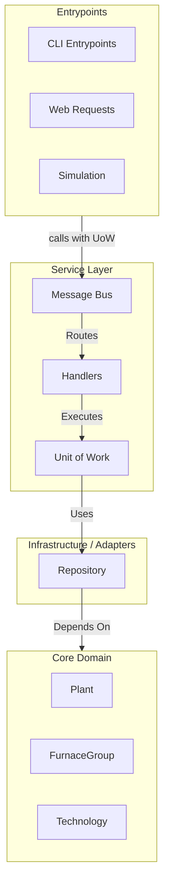

# Architecture

[Why have an Architecture.md?](https://matklad.github.io/2021/02/06/ARCHITECTURE.md.html)

## Status

This document is a work in progress aimed at providing a high-level overview of the system architecture,
focusing on key design principles, patterns, and components.

For a deeper exploration of these topics, the following resources are recommended:

- [Cosmic Python](https://www.cosmicpython.com/)
- [A Philosophy of Software Design](https://www.goodreads.com/book/show/39996759-a-philosophy-of-software-design)
- Classic Paper: [On the Criteria To Be Used in Decomposing Systems into Modules](https://wstomv.win.tue.nl/edu/2ip30/references/criteria_for_modularization.pdf)

## OOD / DDD / Design Patterns...

### Motivation

> Complexity is anything related to the structure of a software system that
> makes it hard to understand and modify the system.  --John Ousterhout 

Our focus is on fighting complexity, so let's be careful not to overdo it!

### Object-Oriented Design (OOD)

While often regarded as somewhat old-fashioned today, given the modern preference for composition over
inheritance, many design patterns are still fundamentally rooted in Object-Oriented Design principles.

### Domain-Driven Design (DDD)

- **Ubiquitous Language** - Establishing a common language between developers and
  domain experts. (See the `Utils and Summaries` > `Glossary` section in the OneNote Document for the project)
- **Decoupling Concerns** - - Separating different aspects of the system to reduce interdependencies.

### Design Patterns

- **Repository Pattern** - Abstracting data access to facilitate the integration of different data sources.
- **Strategy Pattern** - Defining a family of algorithms / models and making them interchangeable.

## Overall System Architecture

The architecture leverages an event-driven design for managing system workflows. Key components include:

1. **Entrypoints**: Provides interfaces for interacting with the system, such as CLI commands or web requests.
2. **Service Layer**: Consists of application services that coordinate the workflow of the system, leveraging the **Message Bus** to handle commands and events effectively.
   1. **Message Bus**: Central component for routing commands and events to the appropriate handlers.
   2. **Unit of Work (UoW)**: Manages the lifecycle of atomic operations and ensures consistency.
   3. **Handlers**: Execute business logic in response to commands and events.
   4. **Checkpoint System**: Provides simulation state persistence for crash recovery and debugging (see [checkpoint documentation](simulation_domain/checkpoint.md)).
3. **Data Infrastructure**: Manages data access and storage using the **Repository Pattern** to abstract and decouple data sources, such as Excel files or databases, from the core domain.
4. **Core Domain**: The central part of the application that encapsulates the fundamental business logic. It should remain independent and not rely on any external libraries or frameworks.
5. **Economic Models**: Implements various economic modeling strategies, such as **Agent-Based Modeling (ABM)** and **Stock and Flow Models**, utilizing the **Strategy Pattern** to allow for interchangeable and extensible modeling approaches.

### Component Diagram



## Testing Strategy and the Test Pyramid

Implementing this architecture not only organizes the system effectively but also fosters a robust
testing strategy aligned with the test pyramid concept. The test pyramid suggests that a software
project should have a large number of unit tests at the base, fewer integration tests in the middle,
and a minimal number of end-to-end tests at the top.

## Example Code

### Entities vs Value Objects

```python

from datetime import date
from dataclasses import dataclass


class SteelPlant:
    id: int
    name: str
    production_capacity: float
    carbon_emission_rate: float


@dataclass
class CarbonEmissionPolicy:
    price_per_ton: float
    start_date: date
    end_date: date
```

- **Entities**: Objects with a unique identity (SteelPlant).
- **Value Objects**: Immutable objects that represent descriptive aspects of the domain (CarbonEmissionPolicy).

### Repository Pattern

```python

# adapters/repositories/interface.py

class SteelPlantRepository:
    def list(self):
        ...

    def add(self, steel_plant):
        ...

# adapters/repositories/excel_steel_plant_repository.py

import pandas as pd
from ...domain.models import SteelPlant


class ExcelSteelPlantRepository:
    def __init__(self, file_path: str):
        self.file_path = file_path

    def list(self):
        df = pd.read_excel(self.file_path)
        return [
            SteelPlant(
                id=row['ID'],
                name=row['Name'],
                production_capacity=row['ProductionCapacity'],
                carbon_emission_rate=row['CarbonEmissionRate']
            )
            for _, row in df.iterrows()
        ]

    def add(self, steel_plant: SteelPlant) -> None:
        # Implement save logic if necessary
        ...
```

## Economic Models

Abstract interfaces for different economic models:

```python
# economic_models/interface.py

from ..domain.models import SteelPlant


class EconomicModel:
    def run(self, steel_plants):
        ...
```

- **Agent-Based Model (ABM)**: A model where agents interact with each other and their environment.

```python
# economic_models/agent_based_modeling.py

from ..domain.models import SteelPlant
from mesa import Agent, Model


class SteelPlantAgent(Agent):
    def __init__(self, unique_id, model, steel_plant):
        super().__init__(unique_id, model)
        self.steel_plant = steel_plant

    def step(self):
        # Agent behavior logic
        ...

    
class ABMEconomicModel:
    def run(self, steel_plants):
        class SteelIndustryModel(Model):
            def __init__(self):
                self.schedule = ...  # Initialize scheduler
                for sp in steel_plants:
                    agent = SteelPlantAgent(sp.id, self, sp)
                    self.schedule.add(agent)

            def step(self):
                self.schedule.step()

        model = SteelIndustryModel()
        for _ in range(100):  # Run for 100 steps
            model.step()
```

- **Stock and Flow Model**: A model that represents the flow of resources between different entities.

```python
# economic_models/stock_and_flow.py


class StockFlowEconomicModel:
    def run(self, steel_plants):
        # Implement stock and flow logic
        ...
```

## Service Layer

Coordinate Operations with Application Services. Use application services to orchestrate
the workflow without embedding business logic.


## Entry Points 

```python
# simulation.py

from .service_layer.message_bus import MessageBus
from .economic_models import EconomicModel


class Simulation:
    """
    A class to run a simulation using an economic model. The simulation
    uses a MessageBus to handle events and commands and uses the strategy
    pattern to run the economic model.
    """

    def __init__(self, *, bus: MessageBus, economic_model: EconomicModel) -> None:
        self.bus = bus
        self.economic_model = economic_model

    def run_simulation(self) -> None:
        self.economic_model.run(self.bus)
```

## Tie Everything Together

```python
import pytest

from steelo.devdata import get_furnace_group, get_plant
from steelo.domain import events, PointInTime, Year, TimeFrame
from steelo.simulation import Simulation
from steelo.economic_models import PlantAgentsModel


@pytest.fixture
def logged_events(bus):
    """Add a logging event handler for all events."""
    logged_events = []

    def log_events(evt):
        logged_events.append(evt)

    for event, handlers in bus.event_handlers.items():
        handlers.append(log_events)
    return logged_events


@pytest.mark.parametrize(
    "furnace_group, expected_events, expected_status",
    [
        # utilization_rate below threshold -> close furnace group
        (get_furnace_group(utilization_rate=0.5), [events.FurnaceGroupClosed], "Mothballed"),
        # technology not optimal -> change technology
        (get_furnace_group(tech_name="BF-BOF"), [events.FurnaceGroupTechChanged], "Operating"),
        # end of life reached at good utilization rate -> renovate furnace group
        (
            get_furnace_group(
                lifetime=PointInTime(current=Year(2030), time_frame=TimeFrame(start=Year(2010), end=Year(2030)))
            ),
            [events.FurnaceGroupRenovated],
            "Operating",
        ),
        # already optimal technology and end of life not reached -> keep operating
        (get_furnace_group(), [], "Operating"),
    ],
)
def test_simulation_service_with_plant_agent_events(
    bus, logged_events, furnace_group, expected_events, expected_status
):
    # Given a plant with a furnace group
    plant = get_plant(furnace_groups=[furnace_group])
    bus.uow.plants.add(plant)

    # When the simulation is run
    Simulation(bus=bus, economic_model=PlantAgentsModel()).run_simulation()

    # Then the furnace group should have the expected status
    assert furnace_group.status == expected_status

    # And the expected events should have been raised
    raised_event_classes = [type(evt) for evt in logged_events]
    assert raised_event_classes == expected_events
```