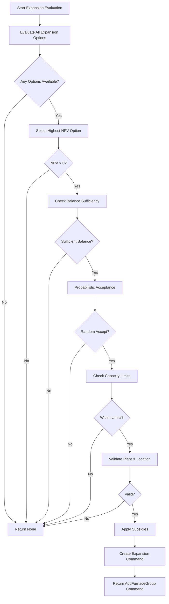

# PlantGroup.evaluate_expansion() Documentation

## Overview

The `evaluate_expansion` function is a critical decision-making method in the PlantGroup class that evaluates and potentially executes furnace expansion across all plants in a plant group. It performs a comprehensive economic analysis to determine whether adding new production capacity is financially viable.

## Purpose

This function serves as the central expansion decision engine for plant groups, determining:
- Which technology to expand
- At which plant location
- Whether the investment is financially justified
- Whether the plant group has sufficient capital
- Whether capacity limits are respected (PAM share vs new plants)

## High-Level Workflow



## Detailed Stage-by-Stage Workflow

### Stage 1: Initialization
- **Purpose**: Set up the evaluation context and log initial state
- **Actions**:
  - Log plant group ID, current year, capacity requirements
  - Log available balance and number of plants
  - Log configuration (probabilistic agents, equity share)
- **Key Variables**: `self.plant_group_id`, `current_year`, `capacity`, `self.total_balance`

### Stage 2: Evaluate All Expansion Options
- **Purpose**: Calculate NPV for all possible technology expansions across all plants
- **Actions**:
  - Call `evaluate_expansion_options()` to get NPV for each plant-technology combination
  - Consider regional CAPEX, subsidies, dynamic feedstocks
  - Pass all subsidy information for proper NPV calculation
- **Decision**: Which technologies can be built at which plants?
- **Output**: Dictionary of expansion options with NPV, technology, and CAPEX

### Stage 3: Check If Any Expansion Options Exist
- **Purpose**: Determine if any viable expansion options were found
- **Decision Point**: Are there any expansion options to consider?
- **Actions**:
  - If empty results: Log "no viable options" and return None
  - If options exist: Log all found options and continue
- **Rationale**: No point continuing if no technologies can be expanded

### Stage 4: Select Highest NPV Option
- **Purpose**: Choose the most profitable expansion option
- **Actions**:
  - Find the plant-technology combination with maximum NPV using `max()`
  - Extract plant_id, NPV, technology name, and CAPEX
- **Decision**: Which option provides the best return on investment?
- **Key Variables**: `highest_plant_and_tech`, `npv`, `tech`, `capex`

### Stage 5: Check NPV Profitability
- **Purpose**: Ensure the best option is actually profitable
- **Decision Point**: Is NPV positive and not None?
- **Actions**:
  - If NPV is None or NPV ≤ 0: Return None (no profitable expansion)
  - If NPV > 0: Continue evaluation
- **Rationale**: Only proceed with profitable investments

### Stage 6: Check Balance Sufficiency
- **Purpose**: Verify plant group has sufficient funds for equity portion
- **Calculation**: `equity_needed = capacity × capex`
- **Decision Point**: Does plant group have enough balance?
- **Actions**:
  - Compare `self.total_balance` with `equity_needed`
  - If insufficient: Log shortfall and return None
  - If sufficient: Log success and continue
- **Note**: Balance deduction happens at FurnaceGroup level, not here
- **Example**: 2,500 kt capacity × $500/t = $1,250,000 equity needed

### Stage 7: Probabilistic Acceptance
- **Purpose**: Model investment decision uncertainty
- **Calculation**:
  - Probabilistic mode: `probability = exp(-(investment_cost) / NPV)`
  - Deterministic mode: `probability = 1.0`
- **Actions**:
  - Generate random number [0, 1]
  - If random_draw ≥ acceptance_probability: Reject and return None
  - If random_draw < acceptance_probability: Accept and continue
- **Rationale**: Higher cost relative to benefit = lower acceptance probability

### Stage 8: Check Capacity Limits
- **Purpose**: Ensure expansion respects capacity allocation between PAM and new plants
- **Validation**:
  - Get product type for the technology (iron or steel)
  - Calculate current expansion/switch capacity (total - new plant capacity)
  - Check if adding new capacity would exceed the limit for that product
- **Limits**: Separate limits for iron (`capacity_limit_iron`) and steel (`capacity_limit_steel`)
- **Actions**:
  - If would exceed limit: Log warning and return None
  - If within limit: Continue
- **Key Calculation**: `expansion_and_switch_capacity + capacity ≤ expansion_limit`

### Stage 9: Validate Plant and Location
- **Purpose**: Ensure selected plant exists and has valid location data
- **Validation Checks**:
  - Plant exists in plant group
  - Plant has ISO3 location code
  - ISO3 maps to a valid region
  - Cost of debt data exists for the country
- **Actions**: If any validation fails, log error and return None
- **Key Variables**: `plant`, `plant.location.iso3`, `region`, `cost_of_debt_original`

### Stage 10: Apply Subsidies
- **Purpose**: Reduce effective costs through government incentives
- **Subsidy Types**:
  - Debt subsidies: Reduce cost of borrowing
  - CAPEX subsidies: Reduce upfront investment
- **Actions**:
  - Get all subsidies for location and technology
  - Filter to only active subsidies for current year using `filter_active_subsidies()`
  - Calculate adjusted cost of debt using `calculate_debt_with_subsidies()`
  - Calculate adjusted CAPEX using `calculate_capex_with_subsidies()`
- **Key Variables**: `selected_debt_subsidies`, `selected_capex_subsidies`, adjusted `cost_of_debt`, adjusted `capex`

### Stage 11: Create Expansion Command
- **Purpose**: Generate the command to add new furnace group
- **Actions**:
  - Generate furnace group ID: `{plant_id}_new_furnace`
  - Verify technology has product mapping
  - Create AddFurnaceGroup command with all parameters including subsidies
  - Log success message with key details
- **Output**: AddFurnaceGroup command object
- **Key Parameters**:
  - Basic: furnace_group_id, plant_id, technology, capacity, product
  - Financial: equity_needed, npv, capex (with/without subsidy), cost_of_debt (with/without subsidy)
  - Subsidies: capex_subsidies, debt_subsidies lists

## Dependencies
- Regional data: CAPEX, FOPEX, subsidies
- Market data: Prices, carbon costs
- Capacity tracking functions for PAM vs new plant allocation
- Bill of materials (BOM) function for technology costs
- Subsidy calculation functions from calculate_costs module

## Input Parameters

| Parameter | Type | Description |
|-----------|------|-------------|
| price_series | dict[str, list[float]] | Product price forecasts by product type |
| region_capex | dict[str, dict[str, float]] | CAPEX by region and technology (USD/tonne) |
| dynamic_feedstocks | dict[str, list[PrimaryFeedstock]] | Primary feedstocks by technology |
| fopex_for_iso3 | dict[str, dict[str, float]] | Fixed OPEX by ISO3 country and technology |
| iso3_to_region_map | dict[str, str] | Mapping from ISO3 country codes to regions |
| probabilistic_agents | bool | If True, apply probabilistic acceptance based on investment risk |
| chosen_emissions_boundary_for_carbon_costs | str | Emissions scope for carbon cost calculations |
| technology_emission_factors | list[TechnologyEmissionFactors] | Emission factors for technologies |
| global_risk_free_rate | float | Risk-free rate for debt subsidy calculations |
| capacity | Volumes | Capacity of new furnace group to evaluate (in tonnes) |
| equity_share | float | Share of investment financed by equity (vs debt) |
| tech_to_product | dict[str, str] | Mapping from technology names to product types |
| plant_lifetime | int | Expected operational lifetime of new furnace (years) |
| construction_time | int | Time to construct new furnace (years) |
| current_year | Year | Current simulation year |
| allowed_techs | dict[Year, list[str]] | Technologies allowed by year |
| cost_of_debt_dict | dict[str, float] | Cost of debt by ISO3 country code |
| cost_of_equity_dict | dict[str, float] | Cost of equity by ISO3 country code |
| get_bom_from_avg_boms | Callable | Function to retrieve bill of materials for a technology |
| capacity_limit_steel | Volumes | Maximum allowed steel capacity from expansions/switches (PAM share) |
| capacity_limit_iron | Volumes | Maximum allowed iron capacity from expansions/switches (PAM share) |
| installed_capacity_in_year | Callable[[str], Volumes] | Function to get total installed capacity for product |
| new_plant_capacity_in_year | Callable[[str], Volumes] | Function to get capacity from new plants for product |
| new_capacity_share_from_new_plants | float | Target share of new capacity from greenfield plants |
| capex_subsidies | dict[str, dict[str, list[Subsidy]]] | CAPEX subsidies by ISO3, technology, and subsidy |
| opex_subsidies | dict[str, dict[str, list[Subsidy]]] | OPEX subsidies by ISO3, technology, and subsidy |
| debt_subsidies | dict[str, dict[str, list[Subsidy]]] | Debt subsidies by ISO3, technology, and subsidy |

## Output

Returns either:
- `AddFurnaceGroup` command if expansion is approved
- `None` if expansion is rejected or not viable

## Decision Tree Summary

```
1. Are there any expansion options? → NO: Exit
   ↓ YES
2. Is the best NPV positive? → NO: Exit
   ↓ YES
3. Do we have enough balance? → NO: Exit
   ↓ YES
4. Do we accept probabilistically? → NO: Exit
   ↓ YES
5. Are we within capacity limits? → NO: Exit
   ↓ YES
6. Is plant/location valid? → NO: Exit
   ↓ YES
7. Apply subsidies and create expansion command
```

## Side Effects

- **NO Balance Deduction Here**: Balance deduction happens at the FurnaceGroup level via command handler, not in this function
- **Command Creation**: Generates AddFurnaceGroup command for message bus processing
- **Logging**: Extensive debug logging throughout the decision process

## Important Notes

1. **Balance Management**:
   - Balance check happens in Stage 6 but deduction occurs elsewhere
   - The command handler deducts equity from FurnaceGroup
   - FurnaceGroup then updates Plant balance
   - PlantGroup.total_balance is computed from Plant balances

2. **Capacity Limits**:
   - Separate limits for iron and steel products
   - Distinguishes between PAM expansions/switches and new plant capacity
   - Helps maintain target allocation between brownfield and greenfield development

3. **Probabilistic vs Deterministic**:
   - The `probabilistic_agents` flag fundamentally changes decision behavior
   - Probabilistic uses formula: `exp(-investment_cost / NPV)`
   - Higher cost/benefit ratio results in lower acceptance probability

4. **Subsidy Application**:
   - Subsidies are filtered to only include those active in the current year
   - CAPEX subsidies reduce upfront investment costs
   - Debt subsidies reduce the cost of borrowing
   - Both types are passed to the AddFurnaceGroup command

5. **Technology Constraints**:
   - Technologies must be in the allowed_techs list for the current year
   - Each technology must have a product mapping (iron or steel)

6. **Logging Levels**:
   - Debug level: Detailed stage-by-stage progress
   - Warning level: Capacity limit violations and errors
   - Info level: Successful expansion approvals
