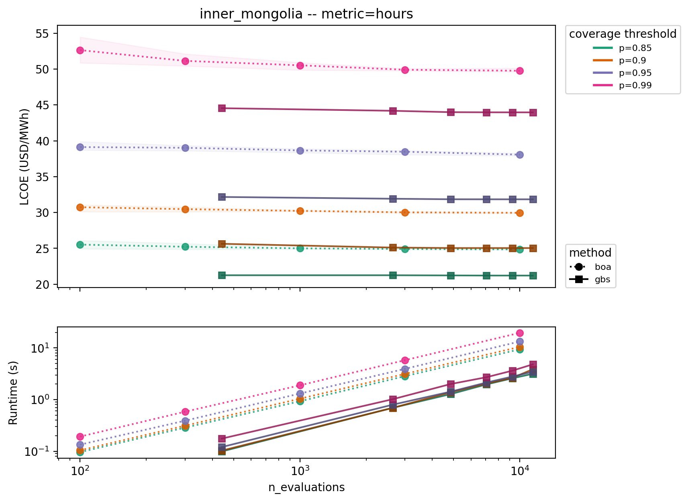
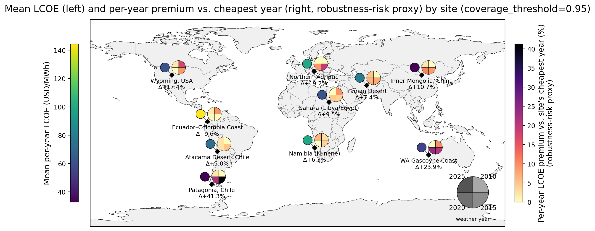

# BOA sampling-vs-optimization benchmark — overview

Full methodology, validation, and findings for the benchmark described in
[README.md](README.md). Read the README first for what this is and how to run it; this doc
is the "why" and the detailed results.

## Setup

A "design" is a triple of overscale factors `(solar, wind, battery)` relative to a fixed
baseload demand. BOA scores a design by simulating its hourly battery dispatch
(`core/cyclic_soc.py`), checking whether it meets a coverage target, then computing LCOE
(`baseload_optimisation_atlas.boa_cost_calculations.calculate_lcoe_of_re_installation`, via
`core/design_metrics.py`'s `score_lcoe`).

Coverage is measured two genuinely different ways (not a strict/relaxed pair of each other
— see the note in `core/gbs.py`'s module docstring):

- `energy`: caps *total* unserved energy across the year — one continuous constraint.
- `hours`: BOA's actual production metric (`boa_logic.calculate_coverage`) — an hour counts
  as covered only if literally zero demand went unserved that hour; caps how many hours may
  be uncovered.

## Method: Grid-Bisection Search (GBS, `core/gbs.py`)

To know how far BOA's sampled design is from optimal, we need a trustworthy optimum to
compare against. GBS is that ground truth. Two structural facts about this specific problem
make a direct search work well here, no MILP required:

1. **The objective is monotone and separable.** LCOE's denominator (`sold_elect_ih_all`,
   `use_curtailment=True`) is `baseload_demand * HOURS_IN_YEAR` — independent of the design.
   So LCOE is a positive constant times total cost, and total cost is additive across
   solar/wind/battery and strictly increasing in each.
2. **Feasibility is monotone.** Raising any of solar/wind/battery raises the SOC trajectory
   pointwise (by induction through the clipped dispatch recursion), which can only turn
   uncovered hours into covered ones.

Together: at fixed `(solar, wind)`, the optimal battery is the *smallest feasible* one, so
`b_min(solar, wind)` is a 1-D **bisection** over a monotone predicate, and the whole problem
reduces to a 2-D coarse-to-fine **grid search** over `(solar, wind)` — hence
"Grid-Bisection Search." Every evaluation runs BOA's own exact dispatch and coverage rule —
no linearization, no foresight dispatch, no rescoring mismatch between what was optimized
and what's reported.

**Validation.** GBS isn't a certified solver either, so it's checked against the one metric
where a certified answer exists: `energy`, via a PyPSA LP (`core/pypsa_model.py`). Running GBS
with that LP's own linear objective reproduced the certified LP optimum to **5e-8
relative** (`--validate`). That calibrates the search machinery on the metric where truth
exists, which is the basis for trusting it on `hours`, where no certified optimum is
tractable at all. `--self-test` separately checks the jitted coverage/dispatch code
bit-for-bit against the unmodified `design_metrics.simulate_design`, and checks
monotonicity (the property the bisection depends on) against 200 random designs.

```bash
uv run python -m scripts.boa_benchmark.core.gbs --site-name inner_mongolia --coverage 0.95 --validate
```

**A subtlety worth knowing before reading the CSV: "certified" is scoped to the LP's own
objective, not to true LCOE.** The LP's `energy`-metric certification above is for its own
*linear* battery-capex objective (a reference-size proxy — see `core/pypsa_model.py`'s
docstring), not the true, concave `score_lcoe` that gets reported everywhere else. GBS
optimizes the true objective directly, so it can legitimately find a *lower* true LCOE than
the LP's design rescored through `score_lcoe` — that's the LP's known linearization gap
showing up, not a bug. Observed at Inner Mongolia, p95, `energy`: the LP's rescored design
comes to ~26.1 LCOE; GBS finds ~25.5 (about 2.3% lower), which is why the sweep CSV can show
`gbs` beating `lp`.

### Why not a MILP?

A MILP variant of the PyPSA model (one binary `hour_covered[t]` per snapshot, since removed
from `core/pypsa_model.py`) was tried first for `hours` coverage and abandoned: its LP
relaxation collapses exactly to the `energy` LP's constraint, so on a real 8760-hour profile
it never certified better than a ~12.5% gap even at a 300s time cap, and its full-foresight
dispatch made some of its "optimal" designs *infeasible* under BOA's own greedy dispatch —
an unattainable ground truth. GBS avoids both problems by using BOA's exact dispatch at
every evaluation instead.

## Findings

### Gap decomposition: the battery heuristic is the culprit

BOA's design has two independent error sources: how good its `(solar, wind)` samples are,
and how good `estimate_battery_capacity`'s heuristic battery size is. The gap between `boa`
and `gbs` in the sweep CSV (~19-21% at Inner Mongolia, p95, `hours`) is driven almost
entirely by the battery-sizing heuristic overestimating, not by `(solar, wind)` sampling: at
the optimal `(solar, wind)` point, `estimate_battery_capacity` returns `b=10.99` against a
true minimum of `b_min=4.10` — nearly 3x oversized. `(solar, wind)` sampling density, by
contrast, converges fast (BOA's LCOE moves very little between 300 and 10,000 samples in the
convergence plot below) and contributes only a small fraction of the total gap.

The convergence plot below is from `run_methodology_comparison.py` /
`plot_benchmark.py`'s regular sweep pipeline (`boa` vs. `gbs` LCOE against `n_evaluations`,
all four coverage thresholds overlaid): `gbs` (solid) settles well below `boa` (dotted) at
every threshold, and the gap barely narrows as `boa`'s sample budget grows from 100 to
10,000 — the flat dotted lines are the "more samples can't fix this" argument, visually.



**This is one site, one threshold** — a documented example, not yet a swept result.
["Running the benchmark"](README.md#running-the-benchmark) in the README produces the fuller
`boa`-vs-`gbs` sweep needed before treating this as a general finding, but the mechanism
(heuristic evaluated at a single percentile pair vs. an exact per-design bisection) is
structural and should hold broadly.

**Coverage note.** `methodology_comparison.csv` — and therefore the convergence plots and
`site_map.png` — currently covers 7 of the 10 sites in `sites.yaml`: `wyoming_usa`,
`iran_desert`, and `namibia_kunene` are missing (they were added after this sweep was last
run; they *do* appear in the weather-year sensitivity sweep below, which is more recent).
Rerunning `run_methodology_comparison.py` across all 10 sites would be needed before treating
the gap-decomposition mechanism as validated repo-wide rather than just at Inner Mongolia.

**Actionable conclusion.** `estimate_battery_capacity` is the biggest culprit behind BOA's
gap to true-optimal LCOE, not sampling density — more/better `(solar, wind)` samples cannot
close it. The lowest-risk production fix is narrower than swapping in all of GBS: keep
BOA's existing `capacity_sampling` candidate generation, and replace only the battery-sizing
step with an exact `b_min` bisection (`gbs._b_min_jit` / `gbs._b_min_grid`, already
implemented and validated here) evaluated per sampled `(solar, wind)` candidate. That
targets the ~19-20pp component directly without changing the sampling/candidate-generation
interface the rest of the codebase depends on. Full GBS (replacing the search itself, not
just the battery step) only adds the remaining ~0.3-1.3pp from sampling error, at
considerably more engineering and runtime cost — see the caveats above on generalizing this
beyond Inner Mongolia before committing to either.

### SOC-mode sensitivity

BOA's production dispatch (`state_of_charge`) always starts the year with an empty battery.
`cyclic_soc.state_of_charge_cyclic` is a periodic alternative (the battery's start-of-year
SOC equals its end-of-year SOC), matching what a battery that's been running for years
actually looks like, and also what PyPSA's `Store(e_cyclic=True)` enforces. Both `boa` and
`gbs` methods can be run under either mode. `plot_soc_mode_sensitivity` isolates how much
this choice alone moves the answer, using the `gbs` method's most-resolved rows so the
effect isn't confounded with sampling or search-resolution noise.

Cyclic dispatch needs an extra bisection (`cyclic_soc.state_of_charge_cyclic`) that
empty-start skips. For `boa` this is negligible (~1-2% runtime difference, dominated by
`score_lcoe`'s Python-level LCOE calculation); for `gbs`, fully jitted with no such overhead
to hide behind, cyclic is genuinely **~6x** slower (measured: 4.4s vs. 26.6s for the same
search) — a real but bounded cost, and `gbs` stays the cheaper method overall regardless.

### Weather-year sensitivity: how much does the choice of weather year matter?

BOA's own inputs (and every finding above) come from a single weather year's Copernicus
profile. `runners/run_weather_year_sensitivity.py` checks how much that choice alone moves the
answer, at all 10 sites, using GBS (`hours` metric, `n_refinements=3`) against four weather
years (2010, 2015, 2020, 2025).

For each site, two designs are compared:
- **Per-year optimal** — `find_gbs_design` run separately against each year's profile:
  "what would have been the cheapest design, in hindsight, for that year alone."
- **Robust** — `find_robust_gbs_design` run against all four years at once: "what do you
  actually have to build if you must commit to a design before knowing which year's weather
  will occur." Valid by the same monotonicity argument GBS already relies on: at fixed
  `(solar, wind)`, the smallest battery meeting every year is the *max* of each year's own
  `b_min`, so the elementwise max of the per-year battery grids is still pointwise-optimal
  and the same coarse-to-fine search applies unchanged (see `find_robust_gbs_design`'s
  docstring in `core/gbs.py`).

**Rejected alternative: don't average a fixed design's LCOE across years.** `score_lcoe`
always calls `calculate_lcoe_of_re_installation` with `use_curtailment=True`, under which
LCOE for a *fixed* design depends only on installed capacity, not the weather profile —
averaging it across years would just return the same number four times. What actually
varies across years for a fixed design is *coverage*, which is what the robust design
directly optimizes against instead.

The map below shows the mean per-year LCOE (left marker, absolute) and each weather year's
own premium over that site's cheapest year (right marker, per-site normalized) — a related
but distinct risk proxy from the "robustness premium" table below: the map checks each year
against the site's *cheapest* year, while the table checks the robust design against the
*mean* of the per-year costs, so the two numbers won't match even at the same site and
threshold (e.g. patagonia_chile's map annotation reads notably higher than its table row).



**Finding: the robustness premium
(`(robust_lcoe - mean(per_year_lcoe)) / mean(per_year_lcoe)`) ranges from +1.6% to +21.5%
across sites and thresholds**, all 10 sites feasible at every threshold once the search box
is widened (`--s-max 20 --w-max 20`; `ecuador_colombia_coast`, near-zero wind resource,
needs the wider box at every threshold, not just p95/p99 as first found):

| site | premium @ p90 | premium @ p95 | premium @ p99 |
|---|---:|---:|---:|
| patagonia_chile | +15.9% | +21.5% | +19.4% |
| n_adriatic | +6.4% | +11.3% | +18.9% |
| wyoming_usa | +6.5% | +9.6% | +13.6% |
| wa_gascoyne_coast | +9.3% | +9.0% | +12.9% |
| ecuador_colombia_coast | +5.6% | +6.5% | +7.0% |
| inner_mongolia | +7.2% | +5.4% | +3.0% |
| sahara_libya_egypt | +2.6% | +4.8% | +6.6% |
| namibia_kunene | +3.3% | +2.9% | +5.4% |
| atacama_desert | +1.6% | +2.6% | +3.8% |
| iran_desert | +2.6% | +2.5% | +15.5% |

(each column its own `n_refinements=3` run: `weather_year_sensitivity_p90.csv`,
`weather_year_sensitivity.csv` (p95), `weather_year_sensitivity_p99.csv`. The max, +21.5%, is
patagonia_chile at p95.)

At most sites the premium grows monotonically with a stricter threshold — tightening the
coverage requirement makes the worst weather year bind harder, and the robust design has to
chase it. Two sites break that pattern, which is itself informative: **`inner_mongolia`**
*shrinks* as the threshold tightens (+7.2% → +5.4% → +3.0%), since no single year's design
satisfies all four years at once and that compromise matters less as required overbuild
grows; **`iran_desert`** stays flat from p90 to p95 then jumps to +15.5% at p99. The
robustness premium is a threshold-dependent property of a site, not a fixed per-site
multiplier you can read off at one coverage level and scale.

**Caveat.** Four snapshot years (2010, 2015, 2020, 2025), not a full climatology — a
genuinely anomalous year outside this sample (e.g. a multi-decade-rare low-wind year) would
not show up here. This is enough to establish that weather-year choice is *not* a negligible
effect at several sites, not a substitute for a longer reanalysis record if this becomes a
production design input.

### Validating the sensitivity against a certified ground truth

Everything above uses GBS, not a certified optimum, for both the per-year and robust
designs. `runners/run_weather_year_sensitivity.py --metric energy --include-lp` checks that
this isn't a GBS-search artifact: it additionally solves the certified PyPSA LP
(`core/pypsa_model.py`) per weather year (`soc_mode` forced to `cyclic` for both sides here,
since the LP has no empty-start variant) and emits `method="lp"` rows alongside `gbs` for
direct per-year comparison, at coverage_threshold=0.95
(`weather_year_sensitivity_energy_lp_p95.csv`, 90 rows: 4 `gbs` + 4 `lp` per site + 1
`gbs_robust`).

Across all 40 site-year pairs, GBS's LCOE is **1.8pp below the LP's rescored design on
average** (std 1.0pp, range -4.4pp to +0.05pp — GBS never loses by more than a rounding
error) — consistent with the same linearization gap already documented above (LP's *own*
objective is a linear proxy for the concave true battery-capex curve; GBS optimizes the true
objective directly and can legitimately come in lower). The gap's sign and rough magnitude
hold at every site and every weather year, not just the single Inner Mongolia/p95 data point
noted earlier, which is the actual claim being validated here: the weather-year sensitivity
findings above aren't an artifact of GBS's search resolution, since GBS tracks a genuine
certified optimum this closely throughout.
